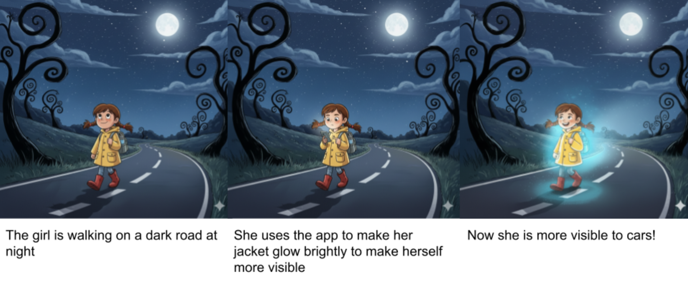
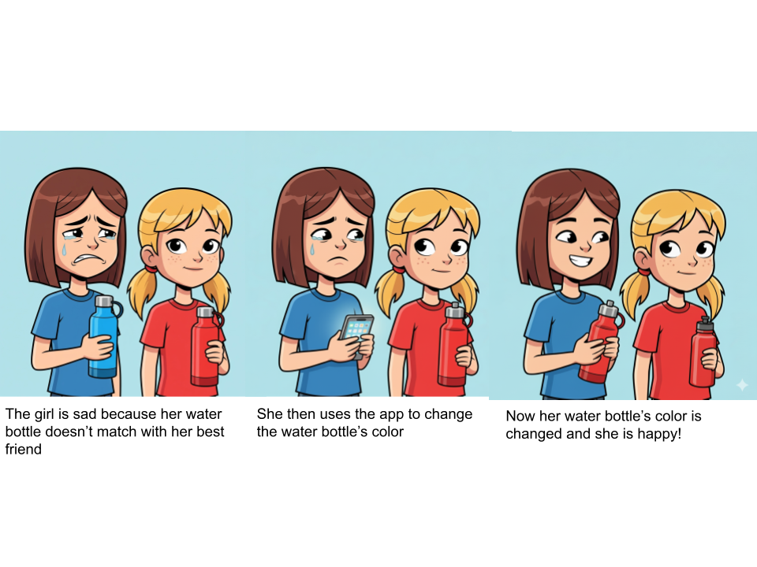
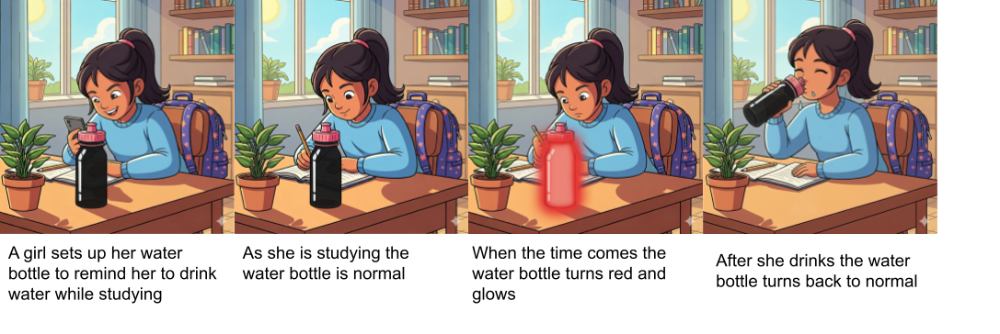
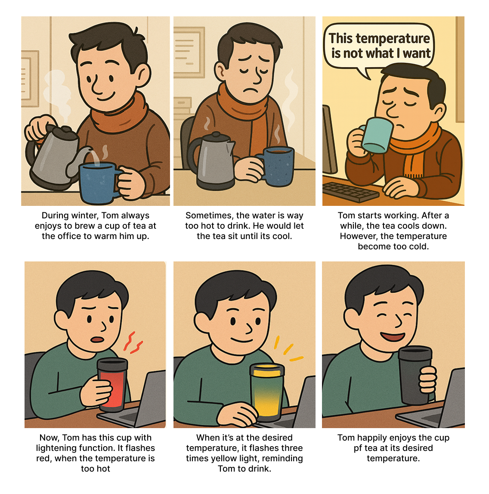
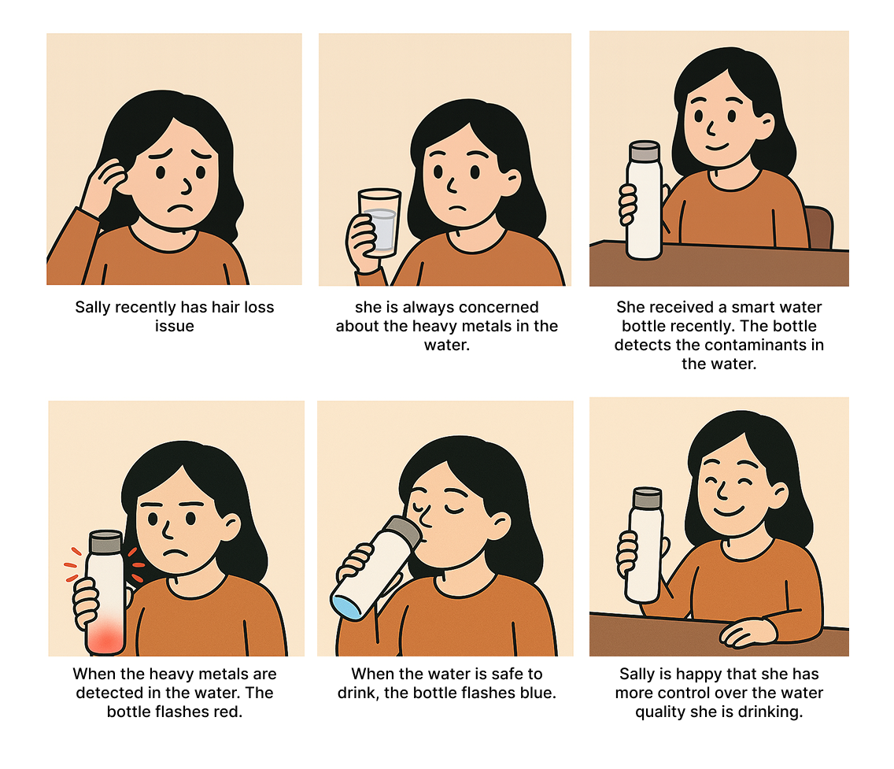
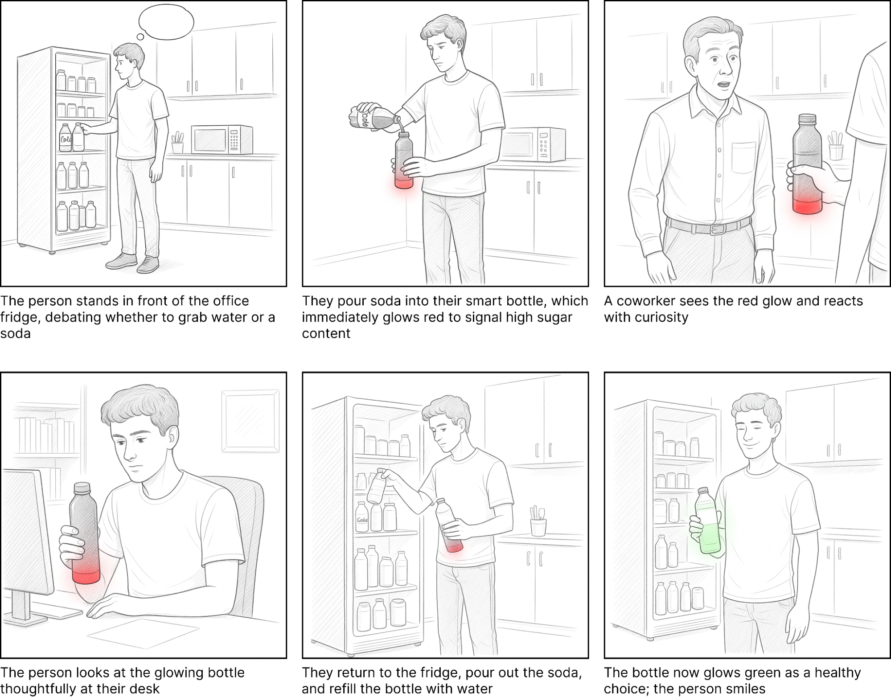
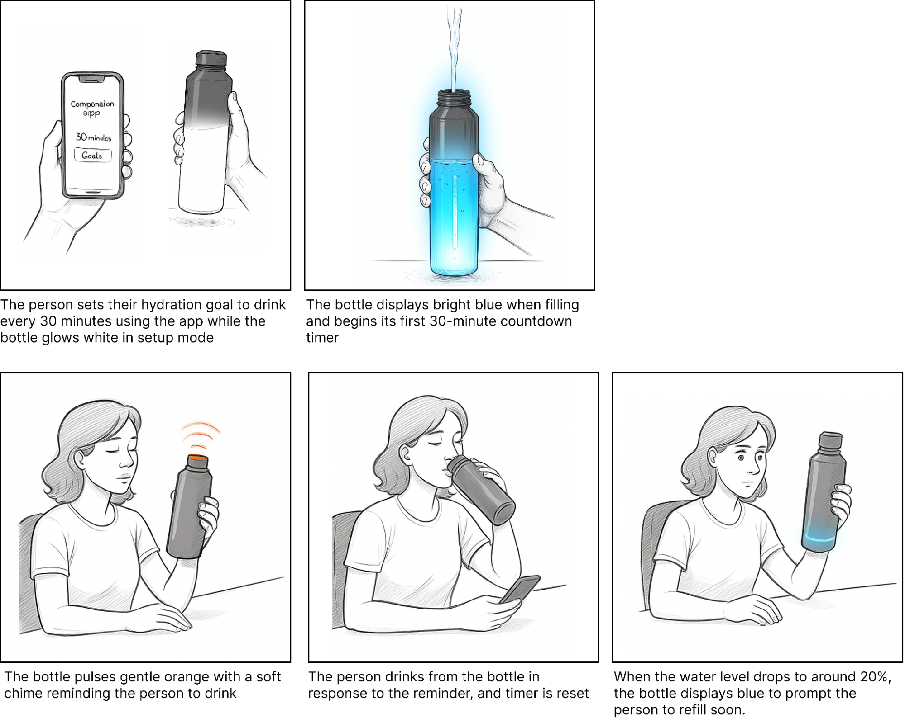
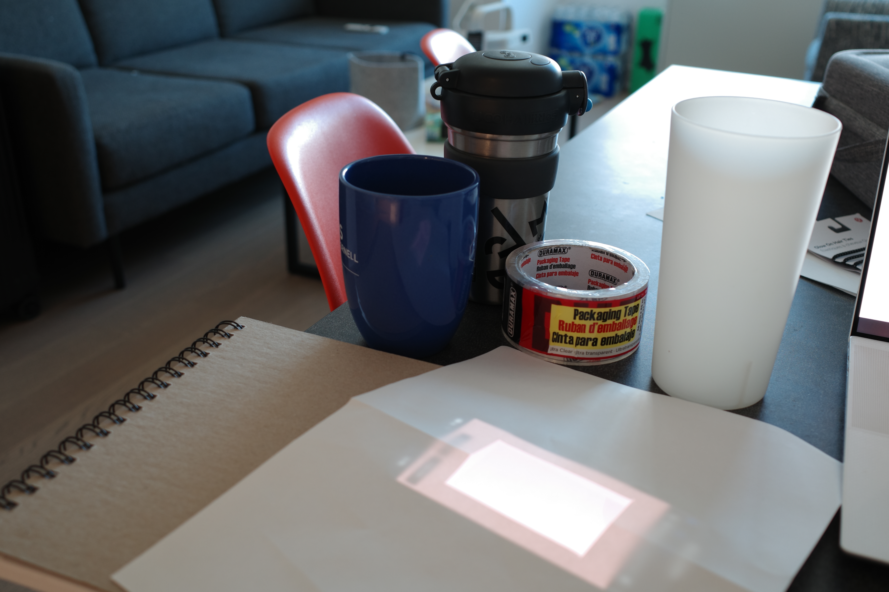

# Staging Interaction

\*\*Jully Li, Sirui Wang, Amy Chen\*\*

## Lab Overview
A) [Plan](#part-a-plan) 

B) [Act out the interaction](#part-b-act-out-the-interaction) 

C) [Prototype the device](#part-c-prototype-the-device)

D) [Wizard the device](#part-d-wizard-the-device) 

E) [Costume the device](#part-e-costume-the-device)

F) [Record the interaction](#part-f-record)

Labs are due on Mondays. Make sure this page is linked to on your main class hub page.

## Part A. Plan 

\*\***Describe your setting, players, activity and goals here.**\*\*

\*\***Include pictures of your storyboards here**\*\*

### Scenario 1: Illuminated clothing

_(Images generated by Gemini 2.5 flash)_

**Setting:** The primary setting would be outdoors at night for the greatest effect. That being said the clothes should also function in different light and weather conditions where they could be worn. 

**Players:** The primary player would be the user wearing the light up clothes, with secondary players being the people around them who can see the clothes. 

**Activity:** 
1) The user finds herself in a low light environment.
2) The user then uses the app to make her jacket glow, choosing the light blue color. 
3) The user’s jacket then begins to glow. 

**Goals:** 
- <ins>Primary User ’s Goal</ins>: Make themselves more noticeable in a low-light environment.
- <ins>Surrounding Individuals’ Goal</ins>: To safely navigate the low-light environment and notice the primary user in order to safely avoid them. 

### Scenario 2: Alter bottle color

_(Images generated by Gemini 2.5 flash)_

**Setting:** The setting would be anywhere, indoor or outdoor, users take their bottles. Common settings could be: offices, sports practices, and classrooms. 

**Players:** The primary player would be the owner of the water bottle with secondary players being those around the user. It’s important to make sure that these secondary players are not bothered by the water bottle. 

**Activity:** 
1) The user notices her friend’s water bottle and wants to match. 
2) The user then uses the app to make her water bottle change colors. 
3) The user’s water bottle now matches her friend’s water bottle. 

**Goals:** 
- <ins>Primary User ’s Goal</ins>: Stay on trend and have matching water bottles with their friends. 
- <ins>Surrounding Individuals’ Goal</ins>: Remain undisturbed by the water bottle. 

### Scenario 3: The water bottle flashes to remind the users to drink water

_(Images generated by Gemini 2.5 flash)_

**Setting:** The setting would be anywhere, indoor or outdoor, users take their bottles. Common settings could be: offices, classrooms, and libraries. 

**Players:** The primary player would be the owner of the water bottle with secondary players being those around the user. It’s important to make sure that these secondary players are not bothered by the water bottle flashing. 

**Activity:** 
1) The user sets up a schedule to remind her to drink water.
2) While the user is studying the water bottle stays normal and out of the way. 
3) When the time comes, the water bottle glows red, getting the user’s attention. 
4) As the user drinks, her water bottle returns its normal state. 

**Goals:** 
- <ins>Primary User ’s Goal</ins>: Get reminders to stay hydrated during long, focused periods of time. 
- <ins>Surrounding Individuals’ Goal</ins>: Remain undisturbed by the water bottle.

### Scenario 4: Detect water temperature

_(Images are generated by ChatGPT-5)_

**Setting:** The kitchen could be the main setting, where users complete the initial action of pouring water into the tea cup. Subsequent drinking behaviors could then take place in any setting where users carry the bottle. The interaction takes place when users monitor the water temperature to ensure it is within their desired range.

**Players:** The primary user is an individual seeking to brew tea at their preferred temperature. Given the portability of the tea cup and its potential use in diverse environments, such as offices setting in the storyboard, it is important to consider contextual factors in which nearby individuals may be affected by the device’s flashing indicator. In the storyboard, these individuals could be coworkers.

**Activity:** 
1) The primary user pours boiling water into his tea cup.
2) The tea cup flashes red to indicate the water is too hot to drink.
3) Set the tea cup aside.
4) The tea cup flashes yellow three times when the tea reaches the perfect temperature.
5) The user drinks his tea at the right warmth.

**Goals:** 
- <ins>Primary User ’s Goal</ins>: Enjoy a perfectly warm cup of tea without constant guessing or burning their mouth.
- <ins>Surrounding Individuals’ Goal</ins>: To remain undisturbed by the interaction; the bottle’s design uses silent, light-based indicators that are clear for the user yet non-intrusive for others.

### Scenario 5: Detect water contaminants

_(Images are generated by ChatGPT-5)_

**Setting:** The primary setting is the kitchen, where the user first fills the smart water bottle with tap water. The interaction continues as she moves between locations, such as their dining area or living room, while drinking throughout the day. The key interaction moments happen when the bottle’s flashing lights communicate the safety of the water.

**Players:** Primary player is an individual actively seeking control over the quality of her drinking water. Surrounding individuals could be the secondary players in the settings, such as housemates, family members, or guests may see the bottle’s flashing indicators. This creates a need for clear, universally understood signals without being overly disruptive.

**Activity:** 
1) The user fills the smart water bottle with tap water.
2) The bottle flashes red to indicate high levels of heavy metals or other contaminants.
3) The user pauses and considers alternatives (e.g., using a filter, boiled or bottled water).
4) After replacing the water with a safe source, the bottle flashes blue to indicate it’s safe to drink.
5) The user drinks confidently, reassured about the water quality.

**Goals:** 
- <ins>Primary User ’s Goal</ins>: Gain peace of mind and control over water quality, reducing anxiety around contaminants potentially linked to their health concerns.
- <ins>Surrounding Individuals’ Goal</ins>: Understand the bottle’s light signals at a glance and avoid unnecessary alarm; the system should be intuitive yet discreet.

### Scenario 6: Detect liquid type

_(Images are generated by Runway Flash 2.5)_

**Setting:** This interaction takes place in everyday environments where drink choices are casually made. For instance, it could be an office breakroom during a long workday.

**Players:** The primary player is the person using the smart bottle; this could be a working adult, student, or fitness person. Secondary players include nearby people like coworkers, family members, or peers who may notice the bottle’s glowing feedback. These surrounding players can have a subtle influence on the primary user through social presence.

**Activity:** The user pours a drink into the smart bottle. Based on the nutritional quality (such as water, soda, or sugary juice) the bottle emits a corresponding light: green for healthy, red for less healthy options. The light acts as immediate, non-verbal feedback. Sometimes the bottle may flash to prompt the user to reconsider. This leads to a small moment of reflection, and possibly a choice to swap for a healthier option.

**Goals:** The user’s goal is to build awareness around what they’re drinking, make healthier choices, and reduce sugar intake.

### Scenario 7: Amount in the bottle

_(Images are generated by Runway Flash 2.5)_

**Setting:** This interaction occurs in everyday environments where hydration habits matter most (such as an office workspace, home desk, or gym) and consistent water intake is necessary.

**Players:** The primary player is the person using the smart hydration bottle.

**Activity:** The user sets up their hydration goals through a companion app, then uses the bottle throughout their day. The bottle actively tracks water levels and time intervals, providing gentle orange pulsing reminders when it's time to drink. When the user responds by drinking, the bottle resets its timer and updates the water level display. If reminders are ignored, the visual cues become more persistent. When water runs low, additional lights encourage refilling. This creates a continuous feedback loop that builds consistent hydration habits through positive reinforcement.

**Goals:** The user's goal is to establish regular drinking habits, maintain optimal hydration levels throughout the day.

\*\***Summarize feedback you got here.**\*\*

**Scenario 1:** “This design greatly contributes to creating a safer driving environment in low-light conditions, and it reminds me of the reflective safety vests typically worn by firefighters..” 

**Scenario 2:** “Need to think about the energy use and how to keep the bottle lit all the time.”

**Scenario 3:** “Great Idea! Probably need to think about how users can set up/customize the reminder.” 

**Scenario 4:** “I like that it shows the problem and directly shows how the product solves it! “

**Scenario 5:** “Very clear indications and very realistic scenario!”

**Scenario 6:**
- “It’s nice how you took into consideration how coworkers may react to the water bottle.”
- “What if users don’t pour the soda into a cup? A lot of people just drink straight from the can…” 

**Scenario 7:**
- “The bright blue filling looks really nice and I like the design with the soft orange. “
- “This has the same idea as Scenario 3. Maybe, we can combine these two together.”

## Part B. Act out the Interaction

Out of all the storyboards, we selected Scenario 4 (Temperature Detection), Scenario 6 (Liquid Type Detection), and Scenario 7 (Volume Detection) to act out and prototype.

\*\***Are there things that seemed better on paper than acted out?**\*\*

\*\***Are there new ideas that occur to you or your collaborator that come up from the acting?**\*\*

**Device #1: Temperature detection**

When we acted out Scenario 4 (detecting temperature), we assumed users would wait nearby for the signal, but acting it out revealed that users naturally walk away and return later, so the feedback needs to be persistent. Instead of single flashing out, a slow “cooling animation” (e.g., slow color transition from red to blue) could help users feel progress and trust the system

**Device #2: Amount in the bottle**

When we acted out Scenario 7 (amount in bottle), we assumed the soft chime would be needed to properly alert the user. However, we realized that the flashing orange should be sufficient. Similarly, we realized that the entire bottle glowing to visualize the water level in the bottle was slightly overkill. Instead the new transition from blue to white would be sufficient and allow us to consolidate the glowing portion of the bottle to a smaller area. 

**Device #3: Type of liquid**

As we acted out Scenario 6 (type of liquid), as we acted it out we realized that there was no need for the glowing indication to be persistent. The initial glowing red or green would be enough to alert the user and have them think twice about their drink choice. Continued glowing after this initial choice may irritate the user or cause them to draw additional unnecessary attention, leading to us to cause the glowing to eventually fade off. 

## Part C. Prototype the device

\*\***Give us feedback on Tinkerbelle.**\*\*

- A small delay between the laptop and phone, but others all work well!

## Part D. Wizard the device
Take a little time to set up the wizarding set-up that allows for someone to remotely control the device while someone acts with it. Hint: You can use Zoom to record videos, and you can pin someone’s video feed if that is the scene which you want to record. 

\*\***Include your first attempts at recording the set-up video here.**\*\*

This was our first attempt at setting up Tinkerbelle in class: https://youtu.be/k2fl0RyPIjQ

\*\***Show the follow-up work here.**\*\*

Finding ways to hide the phone using different costumes

Try to run the Tinkerbelle on Apple Watch SE

## Part E. Costume the device

Only now should you start worrying about what the device should look like. Develop three costumes so that you can use your phone as this device.

Think about the setting of the device: is the environment a place where the device could overheat? Is water a danger? Does it need to have bright colors in an emergency setting?

\*\***Include sketches of what your devices might look like here.**\*\*

\*\***What concerns or opportunitities are influencing the way you've designed the device to look?**\*\*

## Part F. Record

\*\***Take a video of your prototyped interaction.**\*\*

\*\***Please indicate who you collaborated with on this Lab.**\*\*
Be generous in acknowledging their contributions! And also recognizing any other influences (e.g. from YouTube, Github, Twitter) that informed your design. 

# Staging Interaction, Part 2 

This describes the second week's work for this lab activity.

## Prep (to be done before Lab on Wednesday)

You will be assigned three partners from other groups. Go to their github pages, view their videos, and provide them with reactions, suggestions & feedback: explain to them what you saw happening in their video. Guess the scene and the goals of the character. Ask them about anything that wasn’t clear. 

\*\***Summarize feedback from your partners here.**\*\*

## Make it your own

Do last week’s assignment again, but this time: 
1) It doesn’t have to (just) use light, 
2) You can use any modality (e.g., vibration, sound) to prototype the behaviors! Again, be creative! Feel free to fork and modify the tinkerbell code! 
3) We will be grading with an emphasis on creativity. 

\*\***Document everything here. (Particularly, we would like to see the storyboard and video, although photos of the prototype are also great.)**\*\*
